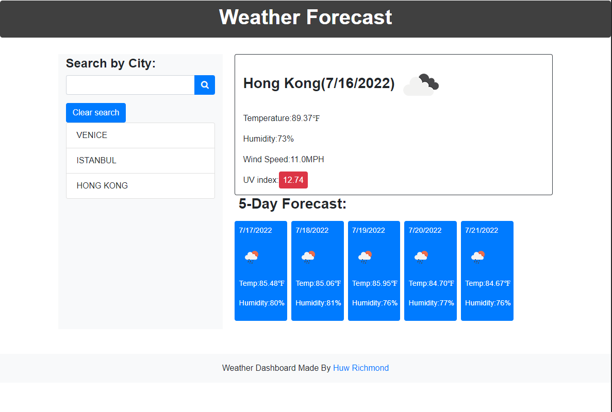

# Weather_App
### Description
The Weather App is a dashboard displayed in browser to display weather conditions of a searched city. Dashboard displays both the current and 5-Day forecast at the same time.
The server-side API used to get response data object is retrieved from the Open Weather APi.
The current weather section includes the details listed below:.

- City, Date, Icon-image
- Temperature
- Humidity
- Wind Speed
- UV index

The 5-day forecast also displays weather conditions for the next 5 days. Weather conditions listed include:

- Date
- Icon image
- Temperature
- Humidity

The local storage is used to store the previous search city and display them to the user in the left side of the page under the list group. The user can also clear the search history by clicking the clear history button.
If the user wants to see the past search city weather condition again, the user can click the list group item cities under the clear history button.

URL for deployed application is: 

### Screenshots:
1. Run file index.html

URL for deployed application is: https://huwrichmond.github.io/Weather_App/